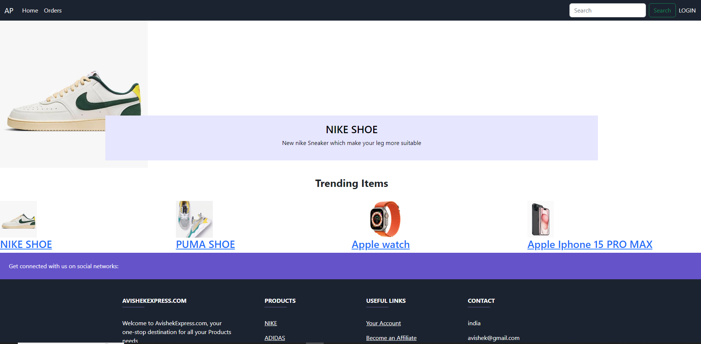

# Laravel E-Commerce Project

## Description

A Laravel-based e-commerce platform designed to provide a seamless online shopping experience for customers.

## Features

- User authentication and registration
- Product catalog with search and filters
- Shopping cart functionality
- Checkout and payment processing
- Order history and tracking
- Admin dashboard for managing products, orders, and customers

## Installation

### Prerequisites

- [PHP](https://php.net) (>=7.2)
- [Composer](https://getcomposer.org)
- [Node.js](https://nodejs.org)
- [Laravel](https://laravel.com) (>=8.0)
- Database (e.g., MySQL, PostgreSQL, SQLite)

### Steps

<h2>Clone the repository:</h2>
<ul>
<li>cd your-ecommerce-project</li> 
<li>composer install</li> 
<li>npm install cp</li> 
<li>.env.example .env</li> 
<li>php artisan migrate --seed</li> 
<li>php artisan serve</li> 
</ul>

Access the application in your web browser at http://localhost:8000
